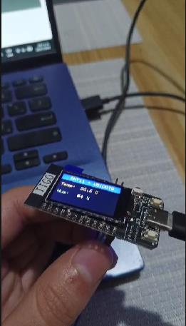
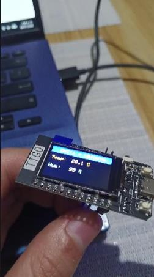
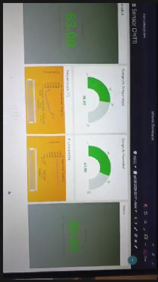
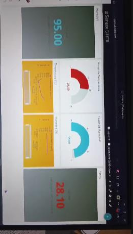
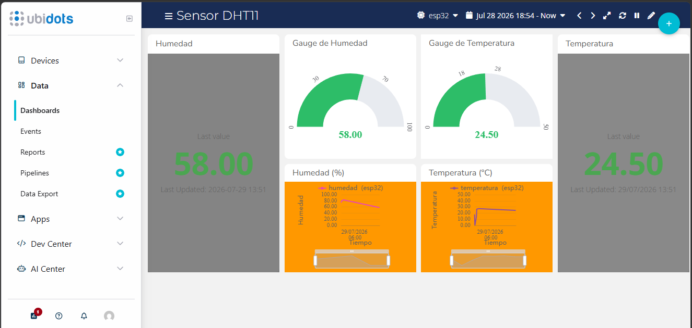

# Sensor DHT11 con ESP32 y Ubidots

**Autor:** Marco Aurelio Guardia Medrano — ID: 000138350

## Descripción

Proyecto que implementa un sistema de monitoreo de temperatura y humedad
usando un ESP32, un sensor DHT11 y una pantalla TFT integrada. Los datos
se visualizan localmente en la pantalla del dispositivo y se envían por
MQTT a un dashboard en **Ubidots** para su visualización remota.

## Componentes utilizados

- **ESP32** (con pantalla TFT integrada, vía librería `TFT_eSPI`)
- **Sensor DHT11** (temperatura y humedad)
- **Ubidots** (plataforma IoT para visualización de datos, vía `UbidotsEsp32Mqtt`)

## Funcionamiento

1. El ESP32 se conecta a la red WiFi y a Ubidots por MQTT.
2. Cada **2 segundos** se lee la temperatura y humedad del sensor DHT11.
3. Los valores leídos se muestran en la pantalla TFT del ESP32.
4. Cada **5 segundos** los datos se publican a Ubidots bajo las variables
   `Temperatura` y `Humedad` del dispositivo `Esp32`.
5. Si la lectura del sensor falla, la pantalla muestra un mensaje de `ERROR`.

## Conexiones

| Componente     | Pin ESP32 |
|----------------|-----------|
| DHT11 (datos)  | GPIO 27   |
| TFT Backlight  | GPIO 4    |

## Configuración

Antes de cargar el código, reemplazar en `src/main.ino`:

```cpp
const char *UBIDOTS_TOKEN = "TU_TOKEN_AQUI";
const char *WIFI_SSID = "TU_SSID_AQUI";
const char *WIFI_PASS = "TU_PASSWORD_AQUI";
```

> ⚠️ **Importante:** nunca subas tu token de Ubidots ni tu contraseña de
> WiFi reales a un repositorio público. Mantén estos valores solo en tu
> copia local del archivo.

## Librerías necesarias (Arduino IDE)

- `UbidotsEsp32Mqtt`
- `TFT_eSPI`
- `DHT sensor library` (Adafruit)

## Evidencia de funcionamiento

Lectura en la pantalla del ESP32 y verificación soplando sobre el sensor:




Dashboard en Ubidots recibiendo los datos en tiempo real:





## Estructura del repositorio

```
.
├── src/
│   └── main.ino        # Código fuente del ESP32
├── images/              # Capturas de evidencia
└── README.md
```
